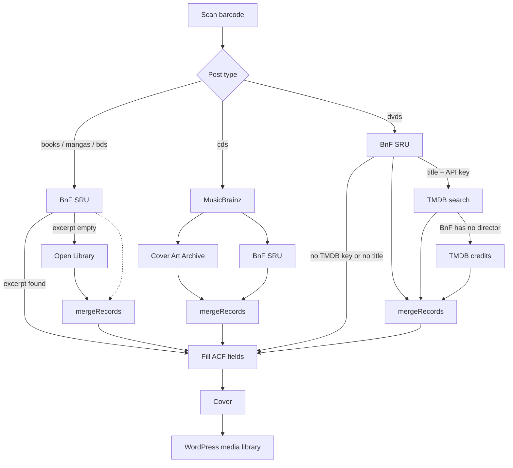

# Advanced Custom Fields: Barcode Scanner

A WordPress plugin that adds a barcode scanner field type to Advanced Custom Fields (ACF),
allowing users to scan barcodes and automatically fetch related data for books, comics,
CDs, and DVDs.

## Description

This plugin extends ACF by adding a custom field type that enables barcode scanning functionality. When a barcode is scanned, the plugin can:

- Query bibliographic APIs (BnF, Open Library, MusicBrainz, TMDB) through a WordPress AJAX proxy
- Merge results so a fallback only fills empty fields
- Upload cover images to the WordPress media library
- Fill ACF fields with title, excerpt, authors, identifiers, and related metadata

Perfect for libraries, bookstores, or any WordPress site that needs to catalog items by barcode.

> **Note:** This plugin is primarily developed for my personal use and personal use case. However, you are welcome to fork it and adapt it to your own needs!

## Features

- 📱 **Barcode Scanner Field**: Custom ACF field type with scanner interface
- 📚 **Books / mangas / BDs**: BnF SRU first; Open Library only if BnF has no résumé
- 💿 **CDs**: MusicBrainz + Cover Art Archive first; BnF fills empty fields (ISNI, résumé, …)
- 📀 **DVDs**: BnF SRU first; TMDB search (and credits if BnF has no director) when an API key is set
- 🖼️ **Media Library Integration**: Sideloads cover images from BnF, Open Library, Cover Art Archive, or TMDB
- 🌐 **AJAX-powered**: Browser never calls third-party APIs directly
- 🌍 **i18n Ready**: Translation-ready with text domain support

## How APIs interact

Every remote call goes through WordPress (`admin-ajax.php`). The browser only talks to two actions: data fetch and cover sideload.



`mergeRecords` never overwrites a field that already has a value. Covers are uploaded only when the post title was empty (new post).

### What each API contributes

- **BnF SRU** (`catalogue.bnf.fr`): UNIMARC records — title, authors, publisher, résumé, identifiers, dimensions, BnF cover page URL
- **Open Library**: title, description, cover JPEG when BnF has no excerpt
- **MusicBrainz**: album title, artists, barcode, year, tracklist
- **Cover Art Archive**: CD front cover (tied to the MusicBrainz release)
- **TMDB**: plot, poster, year; director only when BnF did not provide one

The PHP proxy only allows those hosts (SSRF guard). BnF HTML covers are still scraped from `catalogue.bnf.fr/couverture`; other covers are downloaded from the image URL directly.

## Requirements

- WordPress 5.0 or higher
- Advanced Custom Fields (ACF) Pro 5.0+ or ACF Free 5.0+
- PHP 7.4 or higher (PHP 8.0+ recommended)
- cURL extension enabled (for API requests)
- DOM extension enabled (for HTML parsing)

## Installation

### Manual Installation

1. Download or clone this repository into your WordPress plugins directory:

   ```bash
   cd wp-content/plugins
   git clone https://github.com/LaTableRouge/acf-barcodescanner.git acf-barcodescanner
   ```

2. Navigate to the plugin directory:

   ```bash
   cd acf-barcodescanner
   ```

3. Install dependencies:

   ```bash
   composer install
   npm install
   ```

4. Build assets:

   ```bash
   npm run build
   ```

5. Activate the plugin through the WordPress admin panel under **Plugins**

### Development Setup

For development, you can use the watch mode to automatically rebuild assets:

```bash
npm run watch
```

## Usage

### Adding the Field to ACF

1. Go to **Custom Fields** in your WordPress admin
2. Create a new field group or edit an existing one
3. Add a new field and select **Barcode scanner** as the field type
4. Configure the field settings as needed
5. Save the field group

### Using the Scanner

1. When editing a post/page with the barcode scanner field:
   - Click the **Scanner** button
   - A popup will open allowing you to scan a barcode
   - The plugin will automatically fetch data based on the scanned barcode

### AJAX Endpoints

The plugin provides two AJAX endpoints (admin only):

- `acfbcs_fetch_from_barcode`: Proxies an allowlisted URL and returns JSON or XML as text
- `acfbcs_fetch_cover_from_url`: Downloads a cover and uploads it to the media library

## Development

### Project Structure

```text
acf-barcodescanner/
├── fields/
│   └── class-my-acf-field-barcodescanner.php  # Main field class
├── src/
│   ├── scripts/                               # JavaScript source files
│   │   └── components/providers/              # BnF, Open Library, MusicBrainz, TMDB
│   └── styles/                                # SCSS source files
├── build/                                     # Compiled assets (generated)
├── lang/                                      # Translation files
├── linters/                                   # Linting configurations
├── acf-barcodescanner.php                     # Main plugin file
├── composer.json                              # PHP dependencies
└── package.json                               # Node.js dependencies
```

### Available Scripts

#### Build Scripts

- `npm run build` - Build production assets
- `npm run watch` - Watch mode for development

#### Linting & Formatting

- `npm run lint:js` - Lint JavaScript files
- `npm run lint:scss` - Lint SCSS files
- `npm run lint:php` - Lint PHP files
- `npm run lint:md` - Lint Markdown files
- `npm run prettier:js` - Format JavaScript files
- `npm run prettier:scss` - Format SCSS files
- `npm run prettier:php` - Format PHP files
- `npm run beautify:all` - Run all formatting and linting

### Code Quality

The project uses:

- **PHPStan** (level 5) for PHP static analysis
- **ESLint** for JavaScript linting
- **Stylelint** for SCSS linting
- **Prettier** for code formatting

### PHP Standards

- PHP 8.0+ with type hints
- PSR-12 coding standards
- Namespaced code (`ACFBarcodeScanner` namespace)
- Comprehensive PHPDoc comments

## Customization

### TMDB (DVDs)

TMDB is optional. Without a key, DVDs still fill from BnF only.

In `wp-config.php`:

```php
define('ACFBCS_TMDB_API_KEY', 'your-tmdb-api-key');
```

Or with the `acfbcs_tmdb_api_key` filter.

### Translation (i18n)

**Generate .pot file (from the plugin's directory):**

```bash
wp i18n make-pot . lang/acf-barcodescanner.pot --domain=acf-barcodescanner --exclude=node_modules,vendor,lang --include=*.php,build
```

**Generate JSON translation files for JavaScript (from the plugin's directory):**

```bash
wp i18n make-json lang/ --no-purge
```

## Troubleshooting

### Field Not Rendering

- Ensure ACF is installed and activated
- Check that the field type "Barcode scanner" appears in the field type dropdown
- Verify PHP version is 7.4 or higher

### AJAX Errors

- Check browser console for JavaScript errors
- Verify cURL is enabled in PHP
- Check WordPress AJAX URL is correct
- Ensure proper permissions for media uploads

### Cover Images Not Loading

- Confirm the cover host is allowlisted (BnF, Open Library, Cover Art Archive, TMDB)
- For BnF catalogue pages, the image URL should match `https://catalogue.bnf.fr/couverture`
- Ensure WordPress media library has write permissions

## Support

For issues, feature requests, or contributions, please open an issue on the [GitHub repository](https://github.com/LaTableRouge/acf-barcodescanner).

## Credits

- Built with [Advanced Custom Fields](https://www.advancedcustomfields.com/)
- Uses [barcode-detection-api-demo](https://github.com/tony-xlh/barcode-detection-api-demo/blob/main/scanner.js)
- Uses [SweetAlert2](https://sweetalert2.github.io/) for UI components
- Integrates with [Bibliothèque nationale de France](https://www.bnf.fr/) (SRU catalogue)
- Integrates with [Open Library](https://openlibrary.org/), [MusicBrainz](https://musicbrainz.org/), [Cover Art Archive](https://coverartarchive.org/), and [TMDB](https://www.themoviedb.org/)
