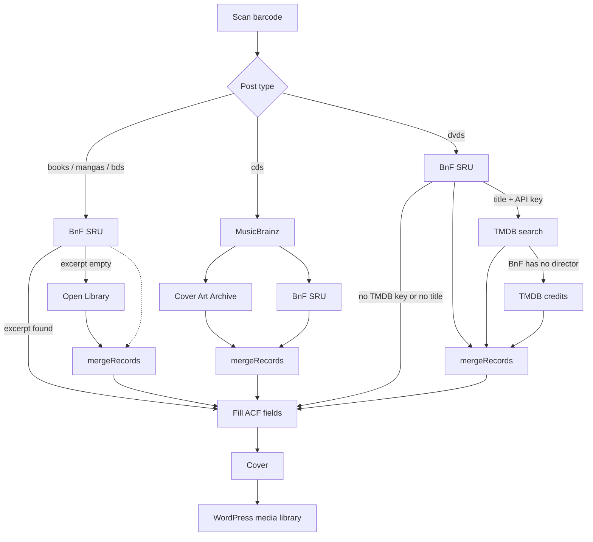

# Advanced Custom Fields: Barcode Scanner

A WordPress plugin that adds a barcode scanner field type to Advanced Custom Fields (ACF),
allowing users to scan barcodes and automatically fetch related data for books, comics,
CDs, and DVDs.

## Description

This plugin extends ACF by adding a custom field type that enables barcode scanning functionality. When a barcode is scanned, the plugin can:

- Query bibliographic APIs (BnF, Open Library, MusicBrainz, TMDB) through a WordPress AJAX proxy
- Merge results so a fallback only fills empty fields
- Upload cover images to the WordPress media library
- Fill ACF fields with title, excerpt, authors, identifiers, and related metadata

Perfect for libraries, bookstores, or any WordPress site that needs to catalog items by barcode.

> **Note:** This plugin is primarily developed for my personal use and personal use case. However, you are welcome to fork it and adapt it to your own needs!

## Features

- 📱 **Barcode Scanner Field**: Custom ACF field type with scanner interface
- 🗺️ **Fill mapping**: Optional textarea on the field. One line (`author = your_field`) sends a fetched key to whatever ACF `data-name` you use. Empty keeps the built-in filling
- 📚 **Books / mangas / BDs**: BnF SRU first; Open Library only if BnF has no résumé
- 💿 **CDs**: MusicBrainz + Cover Art Archive first; BnF fills empty fields (ISNI, résumé, …)
- 📀 **DVDs**: BnF SRU first; TMDB search (and credits if BnF has no director) when an API key is set
- 🖼️ **Media Library Integration**: Sideloads cover images from BnF, Open Library, Cover Art Archive, or TMDB
- 🔢 **Released volumes (BnF)**: For ongoing books / mangas / BDs, counts the volumes in the BnF catalogue
- 🌐 **AJAX-powered**: Browser never calls third-party APIs directly
- 🌍 **i18n Ready**: Translation-ready with text domain support

## How APIs interact

Every remote call goes through WordPress (`admin-ajax.php`). The browser only talks to three actions: data fetch, cover sideload and released volumes count.



`mergeRecords` never overwrites a field that already has a value. Covers are uploaded only when the post title was empty (new post).

### What each API contributes

- **BnF SRU** (`catalogue.bnf.fr`): UNIMARC records — title, authors, publisher, résumé, identifiers, dimensions, BnF cover page URL
  - Books / mangas / BDs in a series: the publisher is the one shared by most volumes (one extra search on the series title)
- **Open Library**: title, description, cover JPEG when BnF has no excerpt
- **MusicBrainz**: album title, artists, barcode, year, tracklist
- **Cover Art Archive**: CD front cover (tied to the MusicBrainz release)
- **TMDB**: plot, poster, year; director only when BnF did not provide one

The PHP proxy only allows those hosts (SSRF guard). BnF HTML covers are still scraped from `catalogue.bnf.fr/couverture`; other covers are downloaded from the image URL directly.

## Requirements

- WordPress 5.0 or higher
- Advanced Custom Fields (ACF) Pro 5.0+ or ACF Free 5.0+
- PHP 8.0 or higher
- DOM extension enabled (for HTML parsing)

## Installation

### Manual Installation

1. Download or clone this repository into your WordPress plugins directory:

   ```bash
   cd wp-content/plugins
   git clone https://github.com/LaTableRouge/acf-barcodescanner.git acf-barcodescanner
   ```

2. Navigate to the plugin directory:

   ```bash
   cd acf-barcodescanner
   ```

3. Install dependencies:

   ```bash
   composer install
   npm install
   ```

4. Build assets:

   ```bash
   npm run build
   ```

5. Activate the plugin through the WordPress admin panel under **Plugins**

### Development Setup

For development, you can use the watch mode to automatically rebuild assets:

```bash
npm run watch
```

## Usage

### Adding the Field to ACF

1. Go to **Custom Fields** in your WordPress admin
2. Create a new field group or edit an existing one
3. Add a new field and select **Barcode scanner** as the field type
4. Optionally set **Fill mapping** (see below). Leave it empty to keep the built-in filling.
5. Save the field group

### Fill mapping

The scanner field has a **Fill mapping** textarea. One line links a fetched key to one of your fields:

```text
title = post_title
author = writer
excerpt = post_excerpt
isbn = editions.code
year = editions.published
dimensions.width = size.width
dimensions.height = size.height
cover = media
```

The names on the right are examples. Use the `data-name` of your own ACF fields (`writer`, `editions`, `code`, …). The names on the left are fixed: they are the keys returned by the APIs.

- A dot on the left reads a nested value (`dimensions.width`, `dimensions.height`).
- `post_title` and `post_excerpt` are the WordPress title and excerpt.
- `media` uploads the cover to the media library, only when the post title was empty.
- A line starting with `#` is a comment.
- Only empty fields are written. Text, number, textarea and select are filled.

Leave the textarea empty to keep the built-in filling for books, CDs and DVDs.

The scanner field name must still start with the catalogue prefix. That prefix chooses the APIs, not the mapping: `books_`, `mangas_`, `bds_`, `cds_` or `dvds_`.

With a mapping, the released-volumes button is unchanged. It still reads `{post_type}_status`, `{post_type}_editor` and `{post_type}_volumes-total`.

#### Repeater

A dot on the right means “this subfield of this repeater”. Both parts are `data-name`s:

```text
isbn = editions.code
year = editions.published
```

`editions` is the repeater. `code` and `published` are subfields inside it.

One scan adds a single new row to that repeater. Every line that names the same repeater fills that same row. A second scan adds another row.

Mapping the repeater name alone (`isbn = editions`) does nothing: a row needs a subfield. A repeater nested inside another row is ignored. Existing rows are left as they are.

#### Series

Books, mangas and BDs return two titles: `seriesTitle` (the series) and `title` (this volume), plus `volumeNumber`, `isbn` and `year`. Map them onto one repeater. Put `seriesTitle` before `title` when both target `post_title`, so the post is named after the series when the catalogue has one:

```text
seriesTitle = post_title
title = volumes.tome
volumeNumber = volumes.numero
isbn = volumes.isbn
year = volumes.annee
```

`volumes`, `tome`, `numero`, `isbn` and `annee` are your `data-name`s. Each scan appends one volume row.

The mapping always writes `title` into the volume row when that key has a value. The built-in book filling, used when the textarea is empty, writes the volume title only when the series and the volume have different titles, and the post is new or already titled with the series.

#### Keys you can map

- Books, mangas, BDs: `title`, `author`, `editor`, `excerpt`, `isbn`, `year`, `seriesTitle`, `volumeNumber`, `dimensions.width`, `dimensions.height`, `cover`
- CDs: `title`, `artist`, `excerpt`, `idNumber`, `isni`, `year`, `tracklist`, `dimensions.height`, `cover`
- DVDs: `title`, `director`, `editor`, `excerpt`, `idNumber`, `year`, `cover`

`tracklist` is written as one line per track. Put it on a textarea.

### Using the Scanner

1. When editing a post/page with the barcode scanner field:
   - Click the **Scanner** button
   - A popup will open allowing you to scan a barcode
   - The plugin will automatically fetch data based on the scanned barcode

### Checking released volumes

On `books`, `mangas` and `bds`, a **Check released volumes (BnF)** button appears next to **Scan** while `{post_type}_status` is `ongoing`.

- The search uses the post title and `{post_type}_editor`. Several publishers separated by commas (`Dargaud, le Lombard`) run one search each; volume numbers are merged.
- Volume numbers come from UNIMARC `461`, then `225`, then `200`, with an exact match on the normalized series title. Hors-séries and decimal numbers are ignored.
- The highest volume number found is written into `{post_type}_volumes-total` only when it is greater than the current value. Nothing is saved until you update the post.

### AJAX Endpoints

The plugin provides three AJAX endpoints. All of them require the `acfbcs` nonce and the `edit_posts` capability:

- `acfbcs_fetch_from_barcode`: Proxies an allowlisted URL and returns JSON or XML as text
- `acfbcs_fetch_cover_from_url`: Downloads a cover and uploads it to the media library
- `acfbcs_count_series_volumes` (POST, `edit_post` on `post_id`): Searches the BnF for `title` / `publisher` and returns `{ total, max, numbers, records, publishers }`

## Development

### Project Structure

```text
acf-barcodescanner/
├── fields/
│   └── class-my-acf-field-barcodescanner.php  # Main field class
├── includes/
│   └── bnf-series.php                         # BnF released volumes count (AJAX)
├── src/
│   ├── scripts/                               # JavaScript source files
│   │   └── components/providers/              # BnF, Open Library, MusicBrainz, TMDB
│   └── styles/                                # SCSS source files
├── build/                                     # Compiled assets (generated)
├── lang/                                      # Translation files
├── linters/                                   # Linting configurations
├── acf-barcodescanner.php                     # Main plugin file
├── composer.json                              # PHP dependencies
└── package.json                               # Node.js dependencies
```

### Available Scripts

#### Build Scripts

- `npm run build` - Build production assets
- `npm run watch` - Watch mode for development

#### Linting & Formatting

- `npm run lint:js` - Lint JavaScript files
- `npm run lint:scss` - Lint SCSS files
- `npm run lint:php` - Lint PHP files
- `npm run lint:md` - Lint Markdown files
- `npm run prettier:js` - Format JavaScript files
- `npm run prettier:scss` - Format SCSS files
- `npm run prettier:php` - Format PHP files
- `npm run beautify:all` - Run all formatting and linting

### Code Quality

The project uses:

- **PHPStan** (level 5) for PHP static analysis
- **ESLint** for JavaScript linting
- **Stylelint** for SCSS linting
- **Prettier** for code formatting

### PHP Standards

- PHP 8.0+ with type hints
- PSR-12 coding standards
- Namespaced code (`ACFBarcodeScanner` namespace)
- Comprehensive PHPDoc comments

## Customization

### TMDB (DVDs)

TMDB is optional. Without a key, DVDs still fill from BnF only.

In `wp-config.php`:

```php
define('ACFBCS_TMDB_API_KEY', 'your-tmdb-api-key');
```

Or with the `acfbcs_tmdb_api_key` filter.

### Publisher aliases

Replace a catalogued publisher with its imprint (case-insensitive) when filling books / mangas / BDs:

```php
add_filter('acfbcs_publisher_aliases', fn (array $aliases): array => [
    ...$aliases,
    'IDP home video music' => 'Meian',
]);
```

### Translation (i18n)

**Generate .pot file (from the plugin's directory):**

```bash
wp i18n make-pot . lang/acf-barcodescanner.pot --domain=acf-barcodescanner --exclude=node_modules,vendor,lang --include=*.php,build
```

**Generate JSON translation files for JavaScript (from the plugin's directory):**

```bash
wp i18n make-json lang/ --no-purge
```

## Troubleshooting

### Field Not Rendering

- Ensure ACF is installed and activated
- Check that the field type "Barcode scanner" appears in the field type dropdown
- Verify PHP version is 8.0 or higher

### AJAX Errors

- Check browser console for JavaScript errors
- Reload the edit screen if the nonce expired (`-1` / 403 response)
- Check WordPress AJAX URL is correct
- Ensure proper permissions for media uploads

### Cover Images Not Loading

- Confirm the cover host is allowlisted (BnF, Open Library, Cover Art Archive, TMDB)
- For BnF catalogue pages, the image URL should match `https://catalogue.bnf.fr/couverture`
- Ensure WordPress media library has write permissions

## Support

For issues, feature requests, or contributions, please open an issue on the [GitHub repository](https://github.com/LaTableRouge/acf-barcodescanner).

## Credits

- Built with [Advanced Custom Fields](https://www.advancedcustomfields.com/)
- Uses [barcode-detection-api-demo](https://github.com/tony-xlh/barcode-detection-api-demo/blob/main/scanner.js)
- Uses [SweetAlert2](https://sweetalert2.github.io/) for UI components
- Integrates with [Bibliothèque nationale de France](https://www.bnf.fr/) (SRU catalogue)
- Integrates with [Open Library](https://openlibrary.org/), [MusicBrainz](https://musicbrainz.org/), [Cover Art Archive](https://coverartarchive.org/), and [TMDB](https://www.themoviedb.org/)
